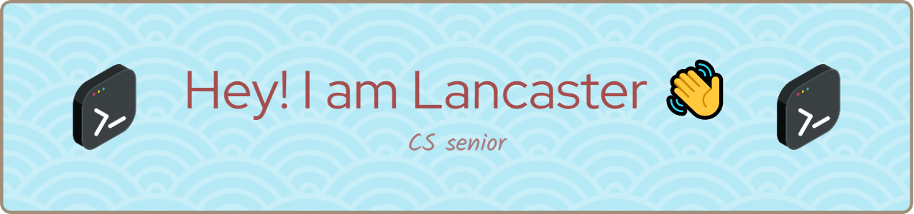

<h1 align="center">Hi, I'm Shuwen (Lancaster) Liu 👋</h1>
<h3 align="center">Always be passionate on the way</h3>

### Hi there 👋

<!--- 🔭 I’m currently working on ...
- 👯 I’m looking to collaborate on ...
- 🤔 I’m looking for help with ...
- 💬 Ask me about ...-->
- 🌱 I’m currently learning in [UC Berkeley](https://eecs.berkeley.edu/) as an exchange student from CQU
- 🔭 I'm currently enthusiastic about **LLM**, **Multimodal Models** and **agents**
- 📫 How to reach me: lancasterl715@gmail.com / lancasterliu_cryp@163.com
- 📝 I regularly write articles(over 200,000 reads) on [CSDN](https://blog.csdn.net/m0_51940505)
- 💬 Know more about my experiences from my [CV](./reference/CV_Shuwen Liu.pdf)
- 😄 Pronouns: she/her/hers
- ⚡ Fun fact: INTJ/INFP

<h3 align="left">Connect with me:</h3>

    
    
    

<h3 align="left">Languages and Tools:</h3>

                    

